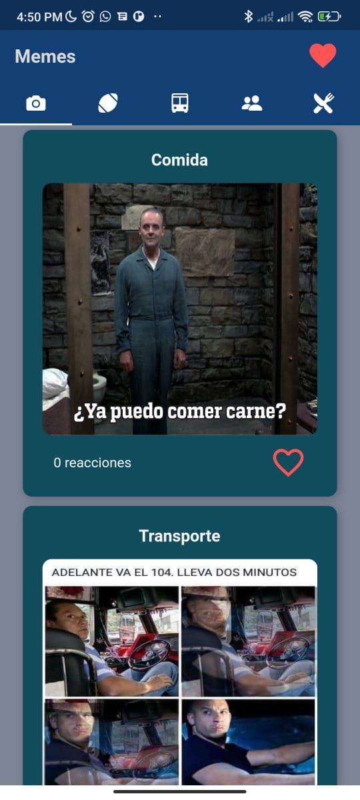
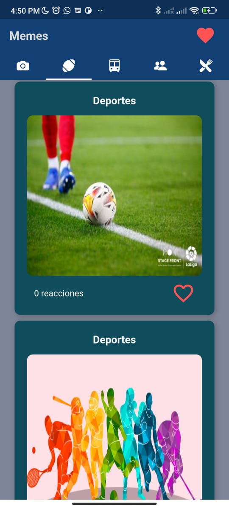
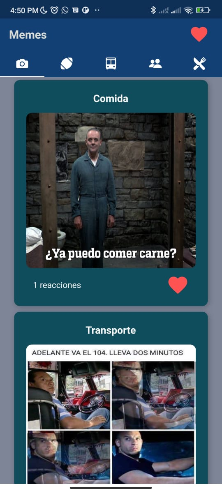
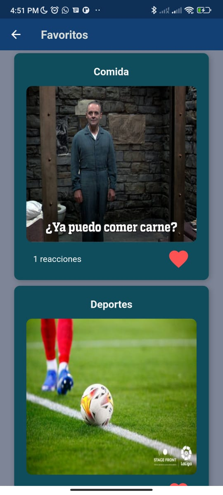
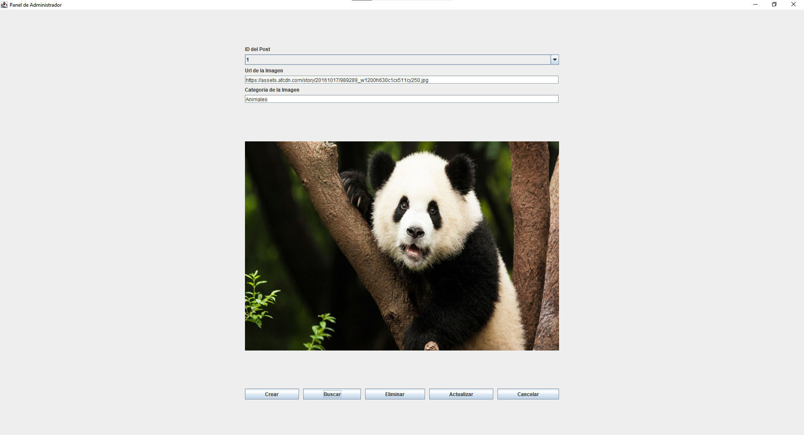
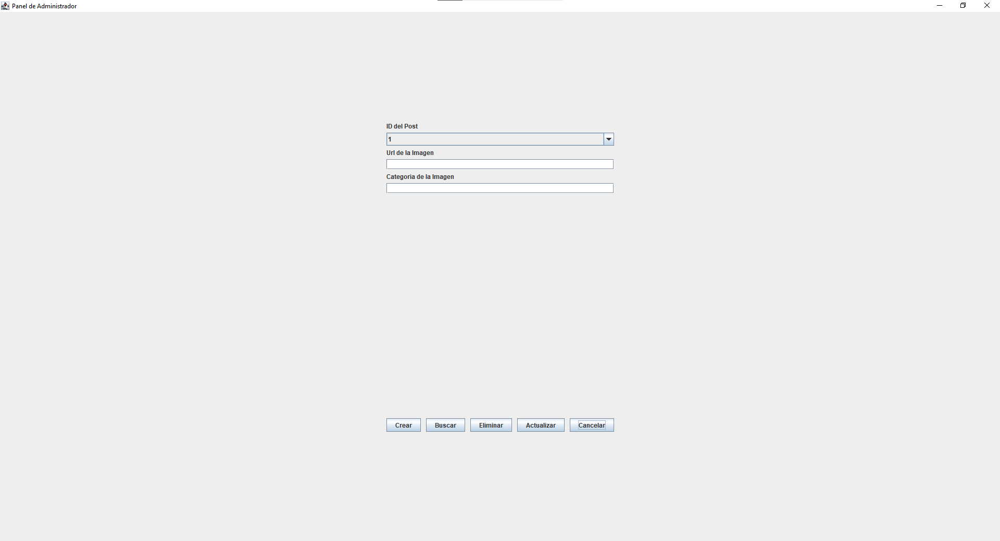

# MemeApp
Servicio web y aplicación móvil escrita en Java y Dart con Flutter para mostrar una lista de imagenes seccionadas por categorias.

# App móvil
La aplicación móvil registra el dispositivo a través de una identificación única que tiene cada dispositivo (dirección mac) por lo que no es necesario tener un inicio de sesión y para brindar seguridad se ofrece un sistema de inicio de sesión a través de sensores que utilizan la huella digital.  
 
 
 
 

# Servicio web
Servicio web escrito en Java con conexión directa a la base de datos MySQL mediante conexiones asíncronas con implementación CORS.

# Panel de administrador
Panel especial para administradores escrito en Java que permite insertar nuevas imágenes por categorías, modificarlas, borrarlas y mostrarlas en forma de lista por su identificador.
 
 
